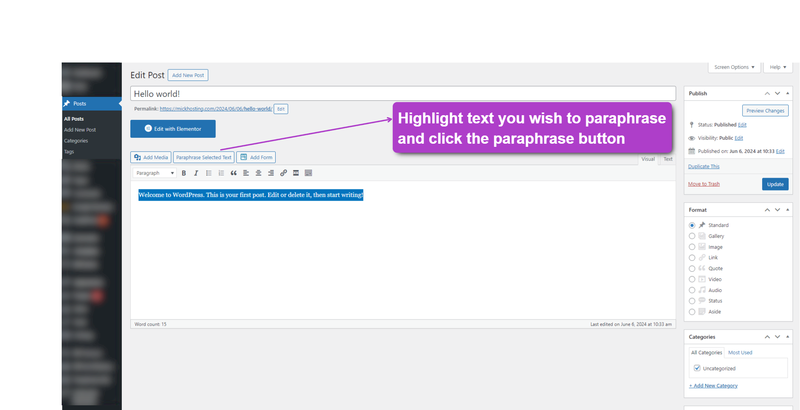
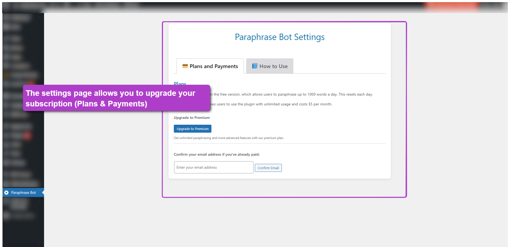
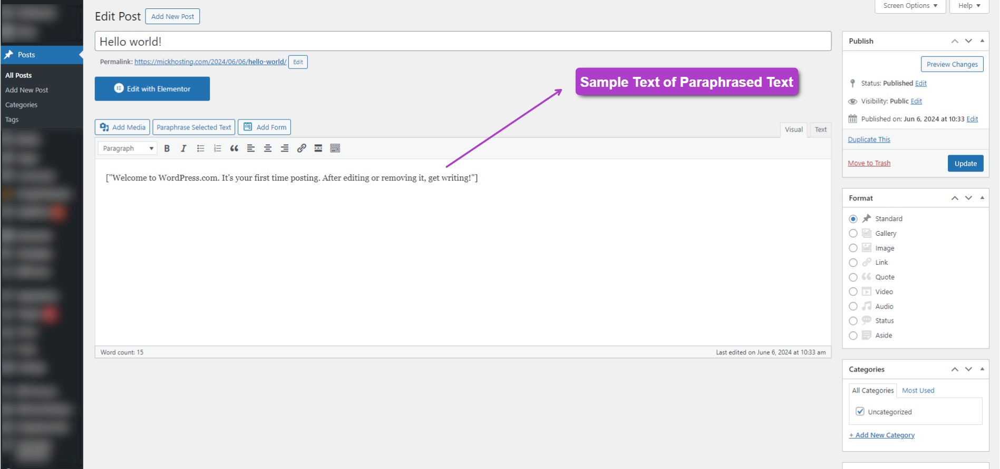

# Paraphrase With AI

Contributors: mickmwanzia
Donate link: https://michaelmick.gumroad.com/l/nkzdfw
Requires at least: 5.0  
Tested up to: 6.6  
Requires PHP: 7.0  
Stable tag: 1.0.0  
License: GPLv2 or later  
License URI: http://www.gnu.org/licenses/gpl-2.0.html  

Paraphrase with AI is a WordPress plugin that helps users paraphrase their posts using AI. 

## Features
– Paraphrase selected text directly in the WordPress editor.
– Free users can paraphrase up to 1000 words per day.
– Premium users enjoy unlimited paraphrasing.

## Installation
1. Download the plugin.
2. Upload it to your WordPress site via the Plugins > Add New > Upload Plugin interface.
3. Activate the plugin.

## Usage
– After activation, you can start paraphrasing text by selecting it in the editor and clicking the "Paraphrase" button.
– Free users have a daily limit of 1000 words.
– Upgrade to premium for unlimited usage.

## Frequently Asked Questions

### How do I upgrade to premium?
You can upgrade to premium by clicking the "Upgrade to Premium" button in the plugin settings. After upgrading, you will have unlimited paraphrasing.

### What happens if I exceed my daily word limit?
If you exceed your daily limit, you will be prompted to upgrade to premium for unlimited usage or wait until the next day when your word count resets.

### Is my data secure?
Yes, your data is handled securely and is not stored or shared with third parties.

## Third-Party Services

This plugin uses external services for paraphrasing functionality and logging. Data is sent to the following services for processing:

- **Paraphrase Genius Service**: The service used to process your text via [RapidAPI](https://rapidapi.com/genius-tools-genius-tools-default/api/paraphrase-genius). No personal information (such as your email address) is shared with this service. You can view their privacy policy here: [https://rapidapi.com/privacy](https://rapidapi.com/privacy).
- **Webhook Log**: The plugin logs webhook events related to subscription upgrades and premium account verification at [https://paraphrase-ai.mick.co.ke/webhook/webhook_data.log](https://paraphrase-ai.mick.co.ke/webhook/webhook_data.log).
- **Webhook Proxy**: To relay the paraphrasing requests, the plugin uses the proxy endpoint [https://paraphrase-ai.mick.co.ke/webhook/proxy.php](https://paraphrase-ai.mick.co.ke/webhook/proxy.php).
- [Privacy Policy](https://paraphrase-ai.mick.co.ke/privacy-policy.html)
## Changelog

### 1.0.0
– Initial release of Paraphrase with AI.

## Upgrade Notice

### 1.0.0
– This is the initial release. Ensure your WordPress version is up-to-date and your PHP version is at least 7.0 for the best compatibility.

## Screenshots

1. **Main Interface:** The main interface where you can select text to paraphrase.
   
2. **Settings Page:** The settings page where you can manage your subscription.
   
3. **Paraphrasing Results:** View the results after paraphrasing your text.
   

## License
This plugin is licensed under the GPLv2 (or later). See the LICENSE file for more details.
